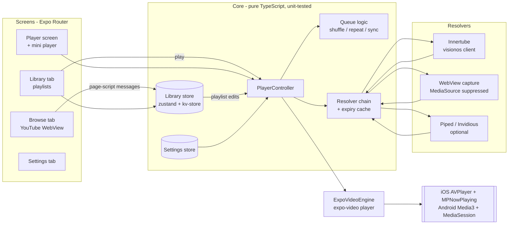

# Replay — Plan & Architecture

Companion to [01-brainstorm.md](./01-brainstorm.md), which explains *why*.
This document covers *what* gets built and *how*.

## 1. Scope of v1

1. **Browse**: in-app YouTube (`m.youtube.com`) with navigation controls, an
   **Add** button for the video on screen, "+" quick-add buttons on thumbnails,
   and a paste-a-link flow.
2. **Library**: playlists (default + custom), reorder, remove, rename, delete.
3. **Playlist mode**: native player with an audio mode and a video mode,
   background playback, lock-screen and notification controls, auto-advance,
   shuffle, repeat, and a sleep timer.
4. **Streams**: resolved on the device (Innertube `visionos` client), falling
   back to Brave-style WebView capture, then an optional Piped/Invidious
   instance.
5. **Links from other apps**: YouTube links opened with Replay (Android intent
   filters) and `replay://add?v=<id>` deep links add to the playlist.

Out of scope for v1 (see §10): offline downloads, lock-screen next/previous
buttons, HD video on Android, importing whole YouTube playlists.

## 2. Tech stack

| Concern | Choice | Version |
|---|---|---|
| Framework | Expo (Continuous Native Generation, EAS Build) | SDK 57 (`expo@57.0.25`) |
| Runtime | React Native, New Architecture, Hermes | 0.86.3 |
| Language | TypeScript (strict) | 6.0 |
| Navigation | Expo Router (Stack + JS Tabs with custom tab bar) | 57.0.23 |
| Browser | `react-native-webview` | 13.16.1 |
| Playback | `expo-video` (`staysActiveInBackground`, `showNowPlayingNotification`) | 57.0.5 |
| State | `zustand` (+ `persist`) | 5.0 |
| Persistence | `expo-sqlite/kv-store` (sync reads, so no empty-library flash) | 57.0.3 |
| Images | `expo-image` (disk-cached thumbnails) | 57.0.5 |
| Tests | Jest (`jest-expo`) + jsdom for injected scripts | 29 |

## 3. Architecture



**Design rules**

- Everything that decides *what* to play (queue, resolver choice, format
  selection, retry logic) is plain TypeScript with no native imports, and is
  unit-tested with fakes.
- The only native surface is first-party Expo modules plus `react-native-webview`,
  wrapped behind small adapters (`MediaEngine`, `CaptureHost`).
- The WebView is only for browsing and for the capture fallback. It never plays
  audio in the background.

## 4. Source layout

```
replay-app/
├── app.json                      # plugins, background modes, intent filters
├── docs/                         # brainstorm + this plan
└── src/
    ├── app/                      # Expo Router routes (thin screens)
    │   ├── _layout.tsx           # root Stack, providers, capture host
    │   ├── +native-intent.tsx    # maps incoming YouTube links to /add
    │   ├── add.tsx               # adds ?v= / ?url= then redirects
    │   ├── (tabs)/_layout.tsx    # JS Tabs + custom tab bar with mini player
    │   ├── (tabs)/index.tsx      # Browse
    │   ├── (tabs)/library.tsx    # Playlists
    │   ├── (tabs)/settings.tsx   # Settings
    │   ├── playlist/[id].tsx     # Playlist detail
    │   └── player.tsx            # Full-screen player (modal)
    ├── features/
    │   ├── youtube/              # URL parsing, oEmbed, Innertube client, formats
    │   ├── resolver/             # chain, cache, capture script + host, remote
    │   ├── library/              # playlists/tracks store
    │   ├── player/               # queue, controller, engine, runtime store, UI
    │   ├── browser/              # page script, browser component, add flow
    │   └── settings/             # settings store
    ├── components/               # shared UI primitives
    ├── theme/                    # colours, spacing
    └── lib/                      # formatting, small utilities
```

## 5. Key flows

### Add while browsing
1. The page script (injected before YouTube's scripts) reports
   `{type:'page', video:{videoId,title,author,durationSec}}` on every in-page
   navigation (History API hooks + title observer + 1.5 s poll).
2. The **Add** button appears; tapping it stores the track in the active
   playlist. Long-press opens the playlist picker.
3. Metadata is then enriched through oEmbed (title/channel) and, after first
   playback, the duration from the player.
4. Quick-add "+" buttons on thumbnails post `{type:'add'}`. The app replies with
   `markAdded` so the buttons turn into ✓.

### Play in the background
1. `PlayerController.playPlaylist(id, startTrack)` builds a queue from the
   playlist.
2. It resolves the current track through the chain, then calls
   `engine.load(source, metadata)` and `play()`.
3. The expo-video player has `staysActiveInBackground = true` and
   `showNowPlayingNotification = true`. Title, channel and artwork go to the
   lock screen and notification.
4. While a track plays, the controller **prefetches** the next track's stream.
5. On `playToEnd`, the controller advances the queue and loads the
   already-resolved next stream immediately. This works while backgrounded or
   locked because the app is still alive (audio is playing).

### Expired or broken stream
- The cache stores `expiresAt` from `streamingData.expiresInSeconds` (or the
  URL's `expire=`) and treats URLs within 10 minutes of expiry as stale.
- On a player error: invalidate the cache for that video, re-resolve once, and
  resume at the same position. On a second failure, show the error and skip to
  the next track after 3 s.

## 6. Data model

```ts
Track    { id /* videoId */, title, author?, durationSec?, thumbnailUrl?, addedAt }
Playlist { id, name, trackIds: string[] /* unique */, createdAt, updatedAt }
Library  { tracks: Record<id, Track>, playlists: Record<id, Playlist>,
           playlistOrder: string[], activePlaylistId }
Queue    { items, order /* play order */, cursor, shuffle, repeat }
Settings { defaultMode, audioQuality, videoMaxHeight, quickAdd,
           resolvers: { innertube, webview, remote: {kind, baseUrl} }, pip }
```

Tracks are shared between playlists and pruned when no playlist references
them. The default playlist cannot be deleted. Persisted data is normalised on
load, so partial or corrupted data can't break the UI.

## 7. Stream resolution

```
resolve(videoId, mode)
  └─ cache hit and fresh? → return
  └─ in-flight? → join
  └─ for strategy in [innertube, webview, remote] (enabled in settings):
        try → validate (has a playable audio or muxed/HLS video stream) → cache → return
  └─ throw ResolveError with the most specific reason
       (e.g. YouTube's playabilityStatus.reason: "Sign in to confirm your age")
```

**Innertube (`visionos` profile)**: `POST https://www.youtube.com/youtubei/v1/player?prettyPrint=false`
with `context.client = {clientName:'VISIONOS', clientVersion:'1.02', deviceMake:'Apple',
deviceModel:'RealityDevice17,1', osName:'visionOS', osVersion:'26.5.23O471', userAgent, hl, gl, visitorData?}`,
`playbackContext.contentPlaybackContext.html5Preference = 'HTML5_PREF_WANTS'`,
`contentCheckOk/racyCheckOk = true`; headers `X-YouTube-Client-Name: 101`,
`X-YouTube-Client-Version`, `Origin`, `User-Agent`, `X-Goog-Visitor-Id`.
The visitor ID comes from the in-app browser (`ytcfg.get('VISITOR_DATA')`),
so requests share the browsing session. Profiles live in one file so they can be
updated when YouTube changes.

**Format selection**
- *Audio mode*: audio-only adaptive format with a direct `url` (formats needing
  `signatureCipher` are skipped). iOS takes AAC/`audio/mp4` only (AVPlayer can't
  play WebM). Android prefers Opus (`251`) for "high" and falls back to AAC.
  "Data saver" picks the lowest bitrate. Default audio track preferred, DRC
  variants avoided.
- *Video mode*: best muxed progressive format ≤ `videoMaxHeight`, else HLS.
- *Live*: HLS for both modes.

**WebView capture**: a hidden, muted WebView loads
`m.youtube.com/watch?v=<id>` with a script injected before YouTube's that
deletes `MediaSource`/`ManagedMediaSource`/`WebKitMediaSource`. It hooks
`HTMLMediaElement.src`/`setAttribute('src')`/`<source>`, ignores `blob:` and
ad playback (`.ad-showing`), and reports the first real `https:` URL (HLS on
iOS, progressive MP4 on Android). One capture at a time, 25 s timeout.

**Remote**: Piped `GET /streams/:id` or Invidious `GET /api/v1/videos/:id?local=true`
(proxied URLs, not IP-bound).

## 8. Playback engine

- `ExpoVideoEngine` owns one `createVideoPlayer(null)` for the app's lifetime,
  so it keeps playing when screens unmount. Settings: `staysActiveInBackground`,
  `showNowPlayingNotification`, `audioMixingMode:'doNotMix'`,
  `timeUpdateEventInterval: 0.5`.
- Sources are `{uri, headers:{'User-Agent'}, contentType, metadata:{title, artist, artwork}}`.
- `<VideoView player>` is mounted only on the player screen in video mode, with
  `allowsPictureInPicture` and `startsPictureInPictureAutomatically` (setting).
- Switching audio⇄video mid-track swaps the source and seeks to the same position.
- Page media playing in the browser pauses Replay, and starting Replay pauses the
  page (one audio source at a time). The browser blocks autoplay
  (`mediaPlaybackRequiresUserAction`).

### Native configuration (`app.json`)
- `expo-video` plugin: `supportsBackgroundPlayback: true`, `supportsPictureInPicture: true`
  (adds iOS `UIBackgroundModes: audio` and the Android media-playback foreground service).
- Android `intentFilters` for `youtube.com/watch`, `/shorts`, `youtu.be` (Open with Replay).
- Scheme `replay` for `replay://add?v=…`.

## 9. Milestones

| # | Milestone | Status |
|---|---|---|
| M0 | Research, brainstorm, plan | ✅ |
| M1 | Core domain: URL parsing, library store, queue (+ tests) | ✅ |
| M2 | Resolver chain: Innertube, formats, cache, capture, remote (+ tests) | ✅ |
| M3 | Browser: page script (+ jsdom tests), browser screen, add flow | ✅ |
| M4 | Player: controller (+ tests with fake engine), engine, mini/full player | ✅ |
| M5 | Library/Settings screens, deep links, polish, app-level render tests | ✅ |
| M6 | On-device QA with a development build (see README checklist) | ⏳ needs a phone |

## 10. Roadmap

1. **Lock-screen next/previous**: small Expo module registering
   `MPRemoteCommandCenter.nextTrackCommand`/`previousTrackCommand` (iOS) and a
   custom media-session layout (Android), or adopt `@rntp/player` under its license.
2. **Offline audio**: download the resolved audio stream with `expo-file-system`
   and play `file://` URIs first (Brave's "cache-first").
3. **HD video on Android**: synthesise a DASH MPD (`data:` URI) from the best
   video-only and audio-only adaptive formats (SegmentBase init/index ranges).
4. **Import YouTube playlists** (`list=`), via Innertube `browse`.
5. **Remote-updatable client profiles** (JSON fetched from this repo).
6. Drag-and-drop reordering, playback speed, SponsorBlock, crossfade.

## 11. Testing and verification

| Layer | How |
|---|---|
| Pure logic (URL parsing, queue, store, formats, cache, chain, controller) | Jest unit tests with fakes |
| Injected scripts (page + capture) | Jest + jsdom, running the real script source |
| Screens and navigation | `expo-router/testing-library` renders the real route tree (native modules faked) |
| Types / lint | `tsc --noEmit`, `expo lint` |
| Bundling | `expo export` for Android and iOS (proves every import resolves under Metro/Hermes) |
| Native config | `expo prebuild` into a temp dir, then assert `UIBackgroundModes`, foreground service, intent filters |
| Device behaviour | Manual checklist in README. It needs a development build on a phone. |

Constraints of the build container: no Android SDK or Xcode, and no network
access to YouTube. So native compilation and live extraction are verified on a
device, not in CI.
